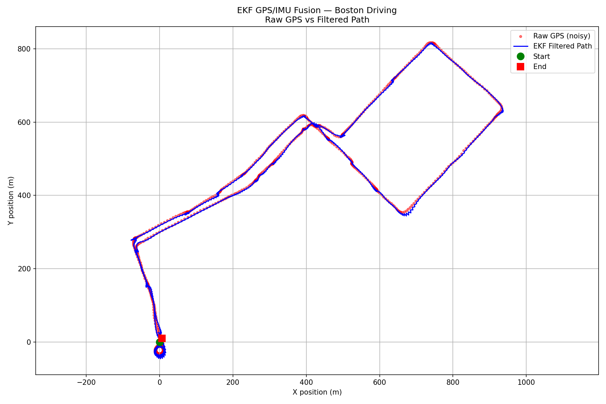
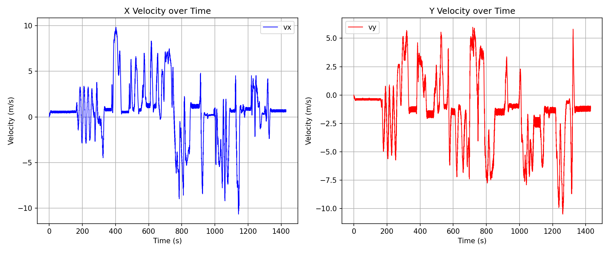
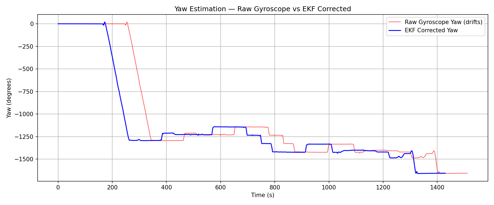
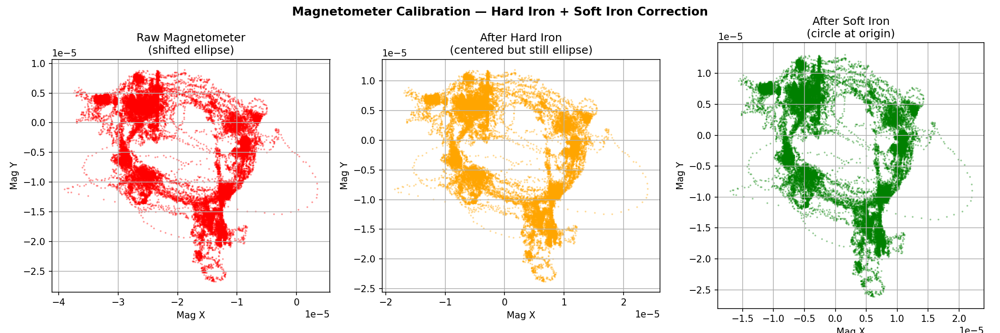
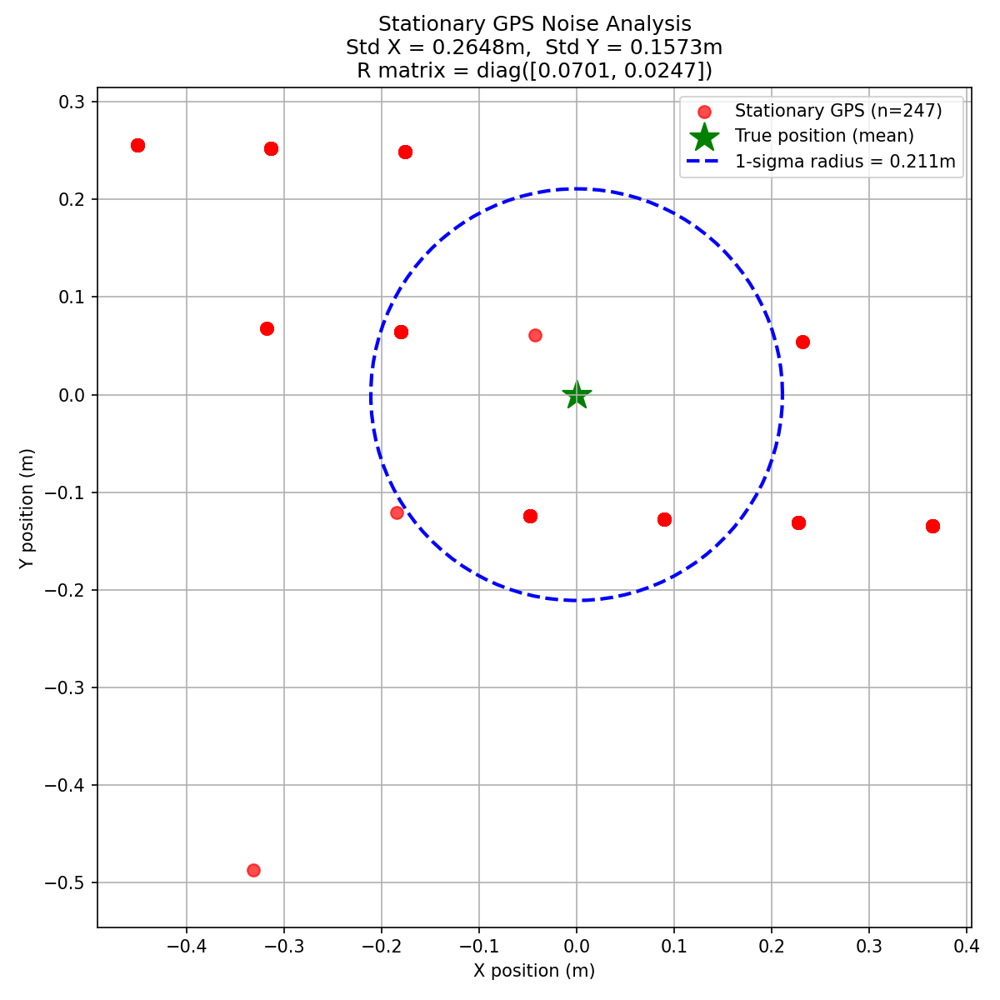

# EKF GPS/IMU Fusion 🤖

> Extended Kalman Filter for real-time GPS/IMU sensor fusion, implemented in ROS2 and tested on real driving data collected around Boston, MA.



---

## Overview

This project implements an **Extended Kalman Filter (EKF)** from scratch to fuse GPS and IMU sensor data for accurate robot localization. The filter combines high-frequency IMU measurements (40Hz) with lower-frequency GPS updates (1Hz) to produce a smooth, accurate position estimate — even in GPS-degraded environments like urban Boston streets.

**Hardware used:**
- VN-100 Inertial Measurement Unit (IMU)
- BU-353S4 GPS Receiver

**Data collected:**
- Stationary (10 minutes) — for noise characterization
- Circular motion — for rotation/yaw validation
- Boston city driving — for real-world performance testing

---

## Results

| Plot | Description |
|------|-------------|
|  | GPS vs EKF filtered path — Boston driving |
|  | Velocity estimation over time |
|  | Yaw — raw gyroscope vs EKF corrected |
|  | Magnetometer hard/soft iron calibration |
|  | Stationary GPS noise analysis |

---

## How It Works

The EKF runs a continuous predict → update loop:

```
State vector: x = [x_pos, y_pos, vx, vy, yaw]

PREDICT (40Hz — IMU driven):
  x̂ = F·x + IMU input
  P̂ = F·P·Fᵀ + Q

UPDATE (1Hz — GPS driven):
  K = P̂·Hᵀ·(H·P̂·Hᵀ + R)⁻¹
  x = x̂ + K·(z - H·x̂)
  P = (I - K·H)·P̂
```

**Key design decisions:**
- GPS latitude/longitude converted to UTM meters using `pyproj` for accurate local positioning
- Noise matrices Q and R derived empirically from stationary sensor data
- Magnetometer hard-iron and soft-iron calibration applied for accurate yaw estimation
- Filter initialized with first GPS reading to minimize convergence time

---

## Tech Stack

| Technology | Purpose |
|-----------|---------|
| ROS2 Humble | Robot middleware |
| Python 3 | Implementation |
| NumPy | Matrix math (EKF equations) |
| pyproj | GPS coordinate conversion |
| Matplotlib | Visualization |
| Ubuntu 22.04 | Operating system |

---

## Project Structure

```
ekf_gps_imu/
├── ekf_gps_imu/
│   ├── ekf_node.py        # EKF ROS2 node (predict + update)
│   └── csv_publisher.py   # Publishes sensor data from CSV
├── analysis/
│   ├── plot_results.py    # Generates all analysis plots
│   ├── plot1_trajectory.png
│   ├── plot2_velocity.png
│   ├── plot3_yaw.png
│   ├── plot4_magnetometer.png
│   └── plot5_stationary.png
├── data/
│   ├── gpstopic.csv       # GPS sensor recordings
│   └── imutopic.csv       # IMU sensor recordings
├── package.xml
└── setup.py
```

---

## Installation & Setup

### Prerequisites
```bash
# Ubuntu 22.04 + ROS2 Humble
sudo apt install ros-humble-desktop
pip install pyproj pandas matplotlib numpy
```

### Build
```bash
mkdir -p ~/ros2_ws/src
cd ~/ros2_ws/src
git clone https://github.com/Rian013/ekf-gps-imu-fusion.git ekf_gps_imu
cd ~/ros2_ws
colcon build
source install/setup.bash
```

### Run
```bash
# Terminal 1 — publish sensor data
ros2 run ekf_gps_imu csv_publisher

# Terminal 2 — run EKF filter
ros2 run ekf_gps_imu ekf_node

# Terminal 3 — visualize output
ros2 topic echo /ekf/odom
```

### Generate Plots
```bash
cd ~/ros2_ws/src/ekf_gps_imu/analysis
python3 plot_results.py
```

---

## EKF Performance

| Metric | Value |
|--------|-------|
| GPS noise (std X) | 0.265 m |
| GPS noise (std Y) | 0.157 m |
| IMU update rate | 40 Hz |
| GPS update rate | 1 Hz |
| Total data points | 60,439 IMU / 1,511 GPS |
| Total driving distance | ~1.2 km around Boston |

---

## Author

**Rian Fernandes**
MS Robotics Engineering — Northeastern University, Boston MA

[](https://github.com/Rian013)
